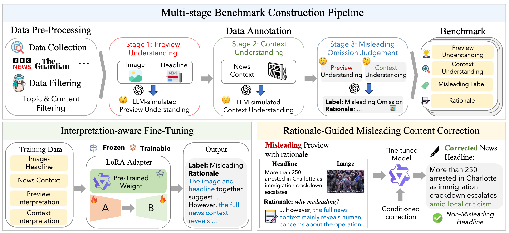

# What's Left Unsaid? Detecting and Correcting Misleading Omissions in Multimodal News Previews" (ACL'26)

This repo contains the data and code for the following paper:

Fanxiao Li, Jiaying Wu, Tingchao Fu, Dayang Li, Herun Wan, Wei Zhou, Min-Yen Kan. [What's Left Unsaid? Detecting and Correcting Misleading Omissions in Multimodal News Previews](https://arxiv.org/abs/2601.05563), The 64th Annual Meeting of the Association for Computational Linguistics, ACL 2026.

## Abstract
Even when factually correct, social-media news previews (image-headline pairs) can induce interpretation drift: by selectively omitting crucial context, they lead readers to form judgments that diverge from what the full article conveys. This covert harm is harder to detect than explicit misinformation yet remains underexplored. To address this gap, we develop a multi-stage pipeline that disentangles and simulates preview-based versus context-based understanding, enabling construction of the MM-Misleading benchmark. Using this benchmark, we systematically evaluate open-source LVLMs and uncover pronounced blind spots to omission-based misleadingness detection. We further propose OMGuard, which integrates (1) Interpretation-Aware Fine-Tuning, which used to improve multimodal misleadingness detection and (2) Rationale-Guided Misleading Content Correction, which uses explicit rationales to guide headline rewriting and reduce misleading impressions. Experiments show that OMGuard lifts an 8B model's detection accuracy to match a 235B LVLM and delivers markedly stronger end-to-end correction. Further analysis reveals that misleadingness typically stems from local narrative shifts (e.g., missing background) rather than global frame changes, and identifies image-driven scenarios where text-only correction fails, highlighting the necessity of visual interventions. 

## Get Started
#### Data Preparation
You can find our data in the datas folder. We have uploaded all images at [Google Drive](https://drive.google.com/drive/u/0/folders/1lcky9vI80MP_fuejTr3vzSzCAbJBzAvD), and you can download them directly.

## The complete code is coming soon.